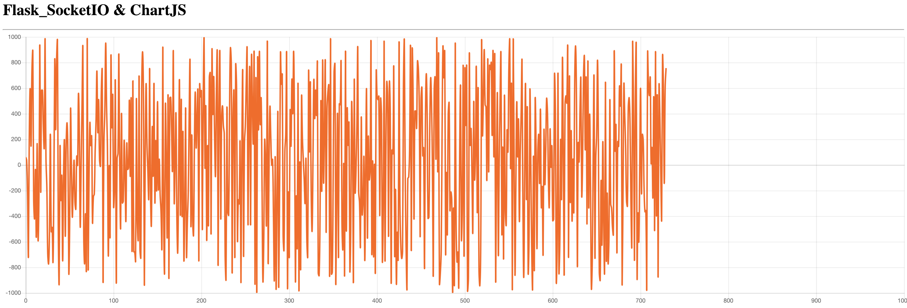

## Flask SocketIO + Chart.js

1. **pip3 install -r requiements.txt**

2. **run server**

   - cd server
   - python3 app.py

3. **Open Browser  [127.0.0.1:8010][http://127.0.0.1:8010]**

4. **test client**
   - cd client
   - python3 test.py

